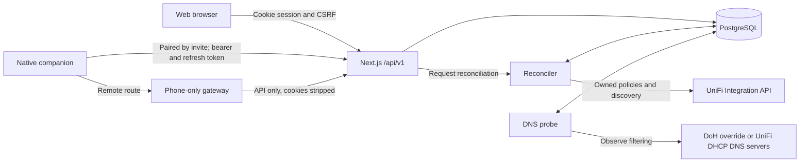

# Architecture

One Next.js App Router application serves the UI and `/api/v1`. All UniFi calls are server-side.
Read the system map, ownership, key flows and feature map first; the remaining sections explain
enforcement and DNS details. [Development conventions](development.md) owns design and coding
rules; [API guidance](api.md) owns the shared client contract.

## System map



The server owns durable household state and background work. Clients display that state and
request changes through the HTTP API. UniFi applies firewall policies; DNS probes independently
observe resolver behaviour. Neither a browser nor a native client gets a UniFi key or talks to
the gateway's management API.

```text
src/app          pages, layouts, api/v1 route handlers
src/components   web UI
src/ui           components shared with the native app (React Native, rendered on the web by react-native-web)
src/server       env, database, auth, schedule, UniFi, reconciliation
src/lib          client-safe constants, types, and pure logic (schedule windows)
prisma           PostgreSQL schema and migrations
openapi          versioned HTTP contract
docker           Dockerfile and Compose files
```

Desired household configuration lives in PostgreSQL. UniFi firewall policies are enforcement only. The application never modifies, disables, deletes, or reorders administrator-created policies, and never calls the policy ordering PUT endpoint.

## Ownership and data relationships

The exact fields and relations live in [schema.prisma](../prisma/schema.prisma). This is a conceptual
map, not a second schema: one deployment serves one household, including tables without a household
foreign key.

| Concept | Owns or relates to |
| --- | --- |
| `Household` | Gateway configuration, managed network scope, timezone, desired revision, resolver defaults and connection identity |
| `Group` → `Device` | Family/Things controls: pause and allowance, as the verbs on the built-in `internet` rule; each discovered network device has an optional group. Unassigned devices are quarantined. |
| `Account` → `Session` | Login identity and permissions. An account can link to a family group; group membership and authentication are separate concepts. |
| `PairedDevice` → `Session` | Paired phones, Watches and agents (with their scope, the account they act as, and a Watch's parent phone) and their device-bound sessions. This is distinct from a network `Device`, even if the same physical phone appears in both. |
| `ConnectionEndpoint`, `Pairing`, `DeviceEdgeToken` | Routes, one-time enrollment and delivery records for encrypted edge credentials; see [connection guidance](api.md#companion-connection-and-https) |
| `Rule` → `RuleGroup`, `RuleWindow`, `RulePolicy`; `Group` → `AppPolicy` | A household rule blocks all internet, a DPI category, apps or websites for one or more groups (or managed networks), always or in named windows; `RulePolicy` records one UniFi policy per window and zone. A group's `AppPolicy` is its pause policy, and app policies also represent quarantine. `PolicyOperation` records external write attempts and creation evidence. |
| `ChangeResult` → `SyncRun` | A requested revision and its outcome versus a reconciliation pass that may settle multiple requests. Actor account/device links attribute the request. |
| `UpstreamCategory` → `UpstreamDomain`, `UpstreamCheck` | Domain lists and observed DNS results. A check belongs to a category and resolver context; an optional group selects a group override. |

### Code boundaries

- [Route handlers](../src/app/api/v1) validate requests and apply [authentication guards](../src/server/guard.ts). Authorization is specified per method in the [authorization matrix](../tests/integration/authorization-matrix.test.ts).
- [src/server](../src/server) owns database access, secrets and external effects. [src/lib](../src/lib) holds client-safe types and logic; the [boundary test](../tests/unit/client-boundary.test.ts) checks transitive imports.
- The [household store](../src/lib/household-store.ts) owns shared household state and mutation feedback for every client; [AppDataProvider](../src/components/AppDataProvider.tsx) wraps it for the browser, and the native app wraps it in its own provider. Pages compose it with domain components; feature-specific data may have a page-owned lifecycle.
- [Reconciliation](../src/server/reconciliation.ts) coordinates enforcement. [Policy ownership](../src/server/unifi/policy-ownership.ts) guards all updates and deletes; planners and the UniFi client live under [src/server/unifi](../src/server/unifi).
- The [native repository](https://github.com/nickberardi/familyfi-ios) owns its implementation and platform guidance. This repository owns the [HTTP and shared behaviour contract](api.md#shared-behaviour-and-consumer-adoption), not a copy of native screen status.

## Key flows

### Startup and reads

[Instrumentation](../src/instrumentation.ts) runs server initialization in the Node runtime outside
builds: it loads configuration, ensures recovery/household/seed data, starts reconciliation and DNS
scheduling, starts update checking, and resumes configured remote access. These are server process
responsibilities; visiting a page is not what starts enforcement.

The [household store](../src/lib/household-store.ts), through the browser's
[AppDataProvider](../src/components/AppDataProvider.tsx), reads the session first, then groups,
devices, rules, sync, gateway settings, household settings and accounts. It refreshes every 15
seconds; generation checks discard superseded reads. An unauthorized session redirects to login.
Initial read errors are shown; periodic refresh failures retain the previous data and mark it
`stale`, which the browser does not show. Do not interpret that retained snapshot as a fresh gateway
observation. A native client passes an offline guard instead: a stale view says so, and its
controls send nothing until a refresh succeeds.

### Pause from intent to feedback

1. The browser selects an action through [group-actions.ts](../src/components/group-actions.ts), and the shared [group-writes.ts](../src/lib/group-writes.ts) sends it through the store using [api.ts](../src/lib/api.ts), including the cookie session's CSRF header.
2. The [pause route](../src/app/api/v1/groups/[id]/rules/[ruleId]/pause/route.ts), called with the reserved rule id `internet`, checks authentication, request shape and group existence, then [runGroupInternet](../src/server/group-internet.ts) enables the group's built-in block rule in PostgreSQL.
3. [enqueueChange](../src/server/changes.ts) increments the household revision, creates a pending `ChangeResult` with actor attribution and requests reconciliation. The route returns the updated group and change reference. The group write and enqueue are separate operations; do not assume the entire path is one database transaction.
4. The browser applies the returned state through [household-state.ts](../src/lib/household-state.ts) and shows saved feedback. [mutate-gate.ts](../src/lib/mutate-gate.ts) prevents a superseded mutation response from replacing a newer one.
5. Reconciliation takes its database lock, reads current desired state and writes only owned UniFi policies. A pause enables the group's built-in rule, whose one unscheduled block policy is planned like any rule's; resume switches the rule off and its policy is deleted. The run records outcomes and settles eligible changes.
6. The browser polls this change's ID and reports applied, partial, failed or still pending, then refreshes. A polling failure leaves the saved state in place and reports a follow-up problem. A later global sync success is not proof that this particular request succeeded.

Evidence: [reconciliation tests](../tests/integration/reconcile.test.ts),
[reconciliation properties](../tests/integration/reconcile-properties.test.ts),
[household state tests](../tests/unit/household-state.test.ts),
[household store tests](../tests/unit/household-store.test.ts) and
[mutation ordering tests](../tests/unit/mutate-gate.test.ts).

### Pairing, sign-in and remote access

Every paired device joins through an invite (`/paired/invites`) and is managed through
`/paired/devices`. An administrator creates a one-time invite through the web Pair Device page,
choosing the adult the phone signs in as; the companion claims it and is signed in, with no
password. A phone invites and claims its Watch itself (`?claim=true`). Pairing establishes both
device trust and the account the device acts as; the device's scope bounds what that session may
do, and the server checks it on each request. A Watch gets its own device identity and its
narrower `rulesOnly` scope. Only administrators sign in or have paired devices: an adult without
administrator access has no sign-in, session or device, and demoting one ends all three (see the
[invariant](../AGENTS.md#invariants)).

Remote routes reach the [phone-only gateway](../src/server/tunnel/phone-gateway.ts), which forwards
only API traffic, strips cookies and stamps tunnel provenance. The ordinary web UI is not exposed
through this path. [API connection guidance](api.md#companion-connection-and-https) explains identity,
signed manifests, pins and revocation. Evidence lives in the
[connection tests](../tests/integration/connection-api.test.ts),
[remote access tests](../tests/integration/remote-access.test.ts) and authorization matrix.

### Saved, applied and observed

| State or failure | Meaning for callers |
| --- | --- |
| Configuration saved | PostgreSQL holds the requested state. This alone makes no claim about UniFi. |
| Change applied | Reconciliation reports the desired policy state applied. This is not an end-to-end traffic measurement. |
| Partial, failed or pending change | Inspect that change and Sync. Preserve saved intent and expose the incomplete enforcement result. |
| UniFi unavailable | Discovery and enforcement cannot be confirmed; existing gateway policies may remain. A successful database write does not repair connectivity. |
| DNS observation | A configured DoH override or DHCP-discovered resolver answered a probe from the FamilyFi host. A device on another VLAN may receive a different answer. |
| DNS unavailable or never checked | Report `unknown`; do not infer open access or successful blocking. |
| Client request fails | Report the request failure. If the response was lost, the client cannot conclude from that alone whether the server saved the request. |

## Feature map

Web pages live under [src/app/(app)](../src/app/\(app\)). Use this map to find the owning area,
then read its callers and focused tests. Native feature details belong in its own repository.

| Web area | Responsibility | Implementation and test starting points |
| --- | --- | --- |
| Family and Things | Group cards/details, membership, the internet zone (pause, allowance, today's timeline) and category marks | [GroupGrid](../src/components/GroupGrid.tsx), [InternetZone](../src/components/InternetZone.tsx) on the shared [src/ui](../src/ui) components and their logic ([group-actions](../src/lib/group-actions.ts), [day-timeline](../src/lib/day-timeline.ts), [internet-zone](../src/lib/internet-zone.ts), [category-marks](../src/lib/category-marks.ts), [group-form](../src/lib/group-form.ts), [filter-sheet](../src/lib/filter-sheet.ts), [group-resolver](../src/lib/group-resolver.ts), [device-assign](../src/lib/device-assign.ts)), [group routes](../src/app/api/v1/groups), [group API tests](../tests/integration/group-detail-api.test.ts), [display vectors](../tests/unit/display-vectors.test.ts) |
| Devices / Unassigned | Discovery, assignment, quarantine and last observed connection details within managed networks | [devices](../src/server/devices.ts), [device-list](../src/lib/device-list.ts), [device-writes](../src/lib/device-writes.ts), [device-detail](../src/lib/device-detail.ts), [reconciliation](../src/server/reconciliation.ts), [quarantine tests](../tests/integration/quarantine-observe.test.ts) |
| Rules and group filter sheets | Household rules (internet, category, app, website), their windows, groups and UniFi policy names | [rules](../src/server/rules.ts), [rule planner](../src/server/unifi/plan-rules.ts), [rule editor](../src/components/rules/RuleEditor.tsx) on the shared [RuleEditorForm](../src/ui/RuleEditorForm.tsx) and its logic ([rule-list](../src/lib/rule-list.ts), [rule-editor](../src/lib/rule-editor.ts), [rule-catalog](../src/lib/rule-catalog.ts)), [rules API tests](../tests/integration/rules-api.test.ts), [DPI tests](../tests/integration/dpi-rules.test.ts) |
| Categories | Domain lists, resolver configuration and DNS observations | [probe](../src/server/upstream/probe.ts), [upstream-writes](../src/lib/upstream-writes.ts), [category API tests](../tests/integration/upstream-categories-api.test.ts), [browser tests](../tests/browser/categories.spec.ts) |
| Settings | Gateway key/network scope, household settings, roles and logins | [gateway settings](../src/server/unifi-settings.ts), [accounts](../src/server/accounts.ts), [authorization matrix](../tests/integration/authorization-matrix.test.ts) |
| Sync | Reconciliation history and per-change outcomes | [reconciliation](../src/server/reconciliation.ts), [changes](../src/server/changes.ts), [reconciliation path tests](../tests/integration/reconcile-paths.test.ts) |
| Pair Device | Companion pairing and remote connection management | [pairing](../src/server/pairing.ts), [paired devices](../src/server/paired-devices.ts), [connection](../src/server/connection.ts), [remote access](../src/server/tunnel/remote-access.ts), the companion client shared with phones ([pairing code](../src/lib/pairing-code.ts), [trust](../src/lib/companion-trust.ts), [requests](../src/lib/companion-request.ts), [pairing](../src/lib/companion-pairing.ts), [session](../src/lib/companion-session.ts), [connection hops and offline policy](../src/lib/connection-hops.ts), [Watch setup](../src/lib/watch.ts)), [pairing browser tests](../tests/browser/pair.spec.ts), [companion tests](../tests/unit/companion-pairing.test.ts) |
| AI agents | Connect an agent from the API page: a prompt with an agent pairing code, the `/agents.md` guide, and the scope that bounds every paired device | [device scopes](../src/server/device-scope.ts), [connection](../src/server/connection.ts), [guide](../openapi/agent-guide.md), [agent tests](../tests/integration/agent-pairing.test.ts), [API docs](api.md#agents) |
| Modes and the in-memory database | `FAMILYFI_MODE` (`prod`, `dev`, `test`, `demo`) picks the gateway, database, data and lock; `DB_MODE=memory` and demo run on in-memory PGlite | [env](../src/server/env.ts) and its [startup copy](../scripts/runtime/mode.mjs), [launcher](../scripts/runtime/memory-database.mjs) and its [database server](../scripts/runtime/pglite-server.mjs), [mode tests](../tests/unit/familyfi-mode.test.ts), [setup](setup.md#modes) |
| Demo mode | The hosted public demo (`FAMILYFI_MODE=demo`): the seed household in memory, its public route, the locked configuration, the banner and the nightly reset | [demo](../src/server/demo.ts), [lock tests](../tests/integration/demo-lock.test.ts), [operations](operations.md#demo-mode), [boot test](../tests/unit/demo-boot.test.ts) |
| API reference | Authenticated interactive HTTP documentation | [OpenAPI](../openapi/familyfi.v1.yaml), [contract validation](testing.md) |

## Desired internet block

A group's internet is shaped by three things, in this order ([internetState](../src/lib/rule-windows.ts)):

```text
paused  = suspension.active && (suspension.until is null || now < suspension.until)
allowed = allowance.active && (allowance.until is null || now < allowance.until)
blocked = paused || (!allowed && any internet-rule window is active)
```

- **Pause** (`POST /groups/{id}/rules/internet/pause`) blocks all internet for every device in the group now, until a time or until resumed. `internet` is the group's built-in rule, "this group has internet": pausing it enables a hidden always-on internet rule (`Rule.systemGroupId`) whose one unscheduled BLOCK policy exists only while it is enabled; resume (or expiry) switches it off and the policy is deleted. It records who paused. The group's `suspension`, `allowance` and `access` are derived from these rules.
- **Internet rules** are optional, and apply to chosen people and things, never a whole network. Each window of an enabled internet rule is its own UniFi policy carrying that window's recurring `schedule`; UniFi starts and ends it, never a clock-driven `enabled` write. An always-on internet rule is one unscheduled policy that keeps the group offline until it is changed or an allowance lifts it. A group with no internet rule is not limited, and says so.
- **An allowance** (`allow` on `internet`) is an allowance lift on each of the group's internet rules that is blocking now, until a time (by default when each rule's active windows end); a second allow gives the lifts a new time: its devices leave those rules' policies. A policy left with nobody keeps its devices and is disabled, so ending the allowance does not create it again. A pause replaces an allowance.
- **A rule pause or allowance** lifts one rule, for every group it covers or for one group alone, until a time. For every group the rule's policies are disabled and keep their devices; for one group that group's devices leave the rule's policies (a policy left with nobody stays disabled with its devices). Pause, resume and extend act on a pause; allow and disallow on an allowance, at either scope.
- **Category, app and website rules** are separate policies, and neither a pause nor an allowance changes them. While an internet window is active they are covered anyway.

Quarantined devices (null `groupId`) are desired-blocked independently of rules. Timed pause and allowance expiry are the only clock-driven writes; membership and quarantine still go through reconciliation.

Discovery and quarantine only include clients whose UniFi **network (VLAN)** is in the household allowlist (`manageAllNetworks` or `managedNetworkIds`). New devices on other VLANs are not ingested and are not added to quarantine policies. Assigned devices that roam off a managed network are left out of FamilyFi policies until they return. UniFi still applies a MAC policy to every VLAN that shares that **firewall zone**; pick networks whose zones match what you want to enforce.

Days identify the local weekday a window starts. Windows are half-open. Evaluation uses the household IANA timezone and local wall time, including both occurrences of a repeated DST time. UniFi uses the console clock for native schedules; household timezone vs console timezone must be aligned or documented.

## Reconciliation

A database-backed lock serializes startup, interval (~30s), and mutation-triggered runs. Overlapping writers, including container replacement, must not apply stale revisions. Interval work is discovery, membership, and pause and allowance expiry — not window start/end. Until a UniFi key is saved in Settings, reconciliation is a no-op.

A successful connected-client read marks observed devices online and previously known absent devices offline, preserving their last-seen time. It also records UniFi's connection start and wired/wireless type. One site-device read per pass resolves a wireless uplink to an access point name. The pass also records each device's IEEE MAC registrant from `src/server/mac-registrants.sqlite`, a committed, indexed snapshot that `scripts/update-mac-vendors.py` rebuilds on request and that records its source hashes. Only reconciliation opens it, read-only, so requests never load it; if it cannot be read, the last recorded manufacturer stays. A failed client read leaves the previous observation intact; API responses label observations older than 90 seconds as last known. These are observations, not traffic measurements.

Each pass reads the gateway's policy list. A recorded FamilyFi policy that is no longer there (someone deleted it on the console) is created again on that pass, even if nothing about its group changed; a stale record whose policy is already gone is simply cleared. A policy FamilyFi created on this console and site (an applied create operation) that no `AppPolicy` or `RulePolicy` record points at any more is deleted — that is what a failed UniFi delete during a rule, group or console change leaves behind. Its creation record is the evidence it is ours, never its name.

If a create may have succeeded but ownership cannot be proven, the app reports an unresolved operation instead of adopting arbitrary `FamilyFi ` prefix matches. Do not delete administrator rules to recover. Every UniFi client the app hands out (`clientForHousehold`, and the fixture client tests inject into reconcile) refuses to update or delete a policy whose id is not on record for the current console and site: an `AppPolicy` or `RulePolicy` row, or an applied create operation. During reconcile the refusal is recorded as that policy's error and shows on Sync.

## UniFi client

`src/server/unifi` talks to the official Network Integration API (contract v10.4.57; live Network 10.6.106) with `X-API-KEY`. Pagination uses limit 200. Internet-block policies use firewall action `BLOCK` (live check: more effective than `REJECT` on this gateway). Policy enable/disable is PUT of the full write body. PATCH is logging-only. The client refuses PUT on policy ordering. `GET` ordering on this console requires `sourceFirewallZoneId`.

Integration bases:

- Local: `https://<console-ip>/proxy/network/integration` then `/v1/...`. A bare hostname is not an integration base.
- Cloud: `https://api.ui.com/v1/connector/consoles/{consoleId}/proxy/network/integration` (not live-tested).

Official client overview/details do not include `networkId`. Mapping:

1. `GET /v1/sites/{siteId}/networks/{networkId}/references` `CLIENT` `referenceId`s
2. Else match `client.ipAddress` to gateway network `ipv4Configuration.hostIpAddress` + `prefixLength` (and `additionalHostIpSubnets`)
3. Zone via `network.zoneId` and/or `zone.networkIds`

Destination zone: first of External, WAN, Internet (case-insensitive). Source: one policy per source zone, and per window of a rule. A rule's policies are named `FamilyFi <rule name>`, with ` – <window name>` once it has more than one window and ` (<zone>)` outside the Internal zone, clipped to UniFi's 100 characters ([policy-names.ts](../src/lib/policy-names.ts)); a rename is a PUT of the same policy. Website rules use a `DOMAIN` destination filter (`domainFilter: { type: "DOMAINS", domains }`), which the gateway matches from DNS lookups, so encrypted DNS can get around it. That payload shape comes from the issue that asked for it (#94) and is not yet proven against a gateway. IP scope: `IPV4_AND_IPV6` with no protocol filter. IPv6 blocking, overnight UniFi scheduler windows, and a second concurrent MAC are unproven; do not claim dual-stack blocking.

### Curated category slots

`src/server/unifi/curated-categories.ts` maps five parent-facing slots onto confirmed
integer DPI category ids: Video (4), Social (24), Gaming (8), VPN (11) and Messaging (0).
`src/lib/rules.ts` mirrors that table for the browser and a unit test asserts the two
cannot drift. Only ids go into a policy body; `catalogName` is the console's own name for
that id and exists for docs and UI. Adult is deliberately not a slot, though the full
catalog still lists it for an arbitrary id pick.

Video, Social and Gaming were read off a household console. VPN and Messaging were added
against a catalog dump of Network 10.6.106 whose ids 4 / 8 / 22 / 24 / 28 reproduce the
already-confirmed map and the fixture's names exactly; that agreement on known ids is
what promotes the two new ones. Messaging is category 0 alone — the catalog also carries
15 "Web instant messengers", but it holds three obscure regional clients and a slot maps
to one id.

**Messaging's id is zero, so nothing on this path may test a target id for truthiness.**
Rule validation is `nonnegative`, not `positive`, and `normalizeTargetIds` filters on
`>= 0`. Both were `> 0` and silently turned a Messaging rule into an empty target list.
An integration test walks the id from the API through to the policy body.

Every curated slot also has a domain list of the same slug behind it in
`src/lib/upstream-domains.ts`, which is what lets its mark report a DNS verdict when no
policy is blocking; a unit test holds that pairing.

Mocks and fixtures do not prove enforcement. `FAMILYFI_MODE` `dev`, `test` and `demo` route Settings and reconciliation through `MockUnifiClient` plus a dummy household seed so the UI can be exercised without a console; production starts only `prod` and `demo` ([modes](setup.md#modes)). The spike CLI (`scripts/spike`) is for live gateway experiments; see [spike/OPERATOR.md](spike/OPERATOR.md).

## Upstream DNS categories

A second, independent signal: domain-list categories resolved through the DNS servers
UniFi DHCP gives managed networks, or an explicit DoH override. **Reporting only.**
Nothing here creates, changes or deletes a UniFi policy, so these routes return no
`change` object and never enqueue reconciliation. UniFi remains the sole enforcement
path.

A verdict has four values and the fourth carries the weight. Every canary blocked is
`blocked`, some is `partial`, none is `open`, and any domain we could not resolve makes
the category `unknown` regardless of the rest. A failed query is a failure to observe,
not an observation: reporting `open` off a failed sweep would tell a parent nothing is
filtered when the truth is that we do not know, and reporting `blocked` would be a false
assurance. Unknown DHCP configuration, an unreachable server and an empty list are all
`unknown` for the same reason.

The same rule holds one level down. Each `UpstreamCheck` keeps the raw per-domain
results from its sweep (`{ domain, blocked }`), which the Category detail screen shows
next to each domain. `domainVerdict()` (`src/lib/upstream.ts`) is the one place that
resolves it: a domain absent from the sweep — never probed, or added since — reads
`unknown`, not `open`, and a domain a household has struck through reads `unknown`
regardless of what an older sweep, taken before the strike, still says about it. Removing
a domain does not touch past checks, so without that second rule a stale `blocked: true`
would outlive the strike-through it sits beside.

`src/lib/upstream-domains.ts` is a **seed, not runtime data**. The probe reads the
database. `ensureUpstreamCategories()` runs at every boot beside
`ensureRecoveryAccount()` — the only place a real deployment creates app-owned rows,
since `dev-seed` runs only with the UniFi mock and a migration cannot import the seed module.
Running every boot is what carries a release's new canaries into an existing household.
A category's label and monogram follow the seed; domain membership does not. A seeded
domain the household removed keeps its `removedAt` and is shown struck through, so the
removal survives an upgrade and can be undone; a domain the household added is deleted
outright. A domain that has left the shipped seed is left in place rather than deleted.

If a new built-in category's slug belongs to a custom category, boot moves the custom
slug to the first available `-custom`, `-custom-2`, etc. before creating the built-in
category. Its id, label, source, enabled setting, domains and checks are preserved.
The move and seed creation share a transaction; repeated boots do not move it again.

The sweep runs on a household-local wall-clock schedule — `Household.dohProbeTime`
("HH:MM") and `dohProbeDays` (0 Sunday–6 Saturday, Sunday by default) evaluated
against `Household.timezone` — not an interval counted from the last boot. A single
`setTimeout` is re-armed after each fire (`src/server/upstream/schedule.ts`), reusing
`nextClockOnDays` (`src/lib/display.ts`), the same DST-correct function behind a rule
window's next start and end. A restart is not itself a trigger: at boot, and on every timer
fire, the process claims the currently-due scheduled instant with a conditional update
(`dohProbeLastRunAt IS NULL OR < due`) inside the existing upstream lock before
sweeping. This is what lets a restart shortly after the scheduled time still catch up
that day's report exactly once, and what keeps two processes off the same run without a
second lock table — one deployment serves one household, so a claim column is enough.
Changing the probe time, days, or the household timezone re-arms the timer immediately
rather than waiting for the next restart.

Lists are uncapped. The twenty-per-category figure bounds what FamilyFi ships, not what
a household may add, and the cost note under each list is how growth is priced.

A category mark on a group card shows whichever thing is actually blocking: a FamilyFi
rule that is blocking **at this moment** is the state shown, and otherwise the mark
reports the downstream status — the DNS verdict for that group's resolver.

Actively blocking is not the same as enabled. A scheduled rule outside its window is
switched on and blocking nothing, so it neither claims the mark nor hides a resolver
that genuinely is blocking. `ruleActivelyBlocking()` evaluates that against the
household timezone through the same `isWindowActive` the desired-block formula uses,
which is why `rule-windows.ts` lives in `src/lib` — one implementation, reachable from
both sides. A malformed schedule evaluates to not-blocking rather than throwing: claiming a
block we cannot verify is the worse of the two failures. `categoryMarkState()` is that
rule and nothing else implements it.

A mark has five states, and the colour answers *who* is blocking. Red is FamilyFi's own
policy, the same red as the sheet's Turn off. Purple is the resolver — solid when it
blocks the whole domain list, a tint when it blocks part of it. Green is a measured
all-clear. Grey is "we have not looked". Both blocking states read the word *blocked*
and the partial one reads *partial*; the two that are not blocking carry no word at all.

Green and grey are separate states on purpose. Green means the probe observed no upstream
block; grey means the upstream result is unknown. A category we never measured must not borrow
green — that false assurance is the thing this whole feature exists to avoid. It is also
why an app mark, which has no resolver behind it, reports grey rather than green
(`appMarkState()`).

The verdict chips on Categories share this palette rather than keeping their own. They
are driven by the same `UpstreamCheck` row, so a colour cannot mean "the resolver blocks
this" on one screen and "nothing blocks this" on the next; the chips used to paint
*blocked* green, which collided head-on with green meaning all-clear on a mark.

A verdict belongs to a resolver, not to a category. `UpstreamCheck` is keyed
`(categoryId, groupId)` with a null group meaning the household aggregate. DHCP-backed
groups have their own rows for the networks holding their devices; a group with
`Group.dohOverrideUrl` has a row for its endpoint. A group inheriting household DoH
uses the household row. `effectiveCheck()` applies that choice wherever the group
appears. Between setting an override and the next sweep a group has no row, and that
reports as "not checked" rather than borrowing the household's.

The unique index is written by hand as `NULLS NOT DISTINCT`: Postgres treats every NULL
as distinct, so the plain index Prisma generates would let a sweep and a "Check now"
each insert their own household row. Sweeps run once per distinct endpoint, so groups
sharing an override share a pass. The override changes what FamilyFi *asks about* a
group — pointing its devices at that resolver is a DHCP or client-side job.

DHCP discovery uses each managed network's `SERVER`-mode addresses, or that network's
gateway address when UniFi selects DNS automatically. Relay and missing DHCP settings
are unknown. Each assigned server is checked; group results cover the networks holding
its assigned devices. Differing complete answers are partial, and an unavailable server
makes the aggregate unknown. Group DoH overrides win over household DoH overrides, which
win over discovery. Each check stores its source and network/server snapshot.

Changing a resolver or turning checking off clears affected checks. A manual check can
run while automatic checking is off; results older than seven days are hidden. Probe writes and
resolver edits share a short household row lock, so a check cannot race its first insert
or restore a result after an endpoint change. DNS I/O runs outside the transaction;
before storing a result the probe verifies that its endpoint is still configured.

DoH uses RFC 8484 wire format (`application/dns-message`) over POST. DHCP-discovered
servers use plain DNS over UDP 53, retrying a truncated answer over TCP 53. Both
transports share wire decoding and blocked-response interpretation.

**Every query carries an EDNS(0) OPT record, and that is load-bearing.** A resolver
only returns an OPT record when the query sent one, and the RFC 8914 Extended DNS Error
that says "I filtered this" rides inside it. Measured against a live NextDNS profile, a
blocked name comes back as **NOERROR with a routable address** — the address of the
provider's block page — and is otherwise indistinguishable from an ordinary answer.
Only the EDE distinguishes it. Drop the OPT record and every block on that provider
reads as "not blocked".

So a name is read as filtered on any of: an EDE of 15 (Blocked), 16 (Censored) or 17
(Filtered); NXDOMAIN; every address being a sinkhole (`0.0.0.0` / `::`); or NOERROR with
no address record. EDE 18 (Prohibited) is deliberately not treated as a block: it says
the client may not query at all, which would apply to every name equally.

Absent an explicit filtering EDE, DNS error codes such as SERVFAIL and REFUSED are
failed observations. Prohibited, truncated and malformed replies also produce `unknown`,
never evidence of upstream filtering. A valid filtering EDE still takes precedence over
an error code because some resolvers deliberately answer blocked queries with REFUSED.

Measured shapes, all four captured live and kept as unit fixtures:

| Resolver | Blocked name answers | EDE |
| --- | --- | --- |
| NextDNS (filtered profile) | routable block-page address | 17 |
| Cloudflare for Families (1.1.1.3) | `0.0.0.0` | 17 |
| Cloudflare (1.1.1.1) | the real address | none |
| Google (8.8.8.8) | the real address | none |

The two filtering resolvers converged on EDE 17 independently. The sinkhole branch is
still needed for a resolver that sinkholes without sending one, and the EDE branch is
the only thing that catches NextDNS, whose answer is otherwise indistinguishable from
the unfiltered ones — the two public resolvers return the same address for that name,
which is what shows NextDNS's is a block page.

This is also why the transport matters beyond conformance. Both filtering resolvers
report the same wire-level EDE, but their JSON APIs spell it differently — Cloudflare
puts it in `Comment`, NextDNS in an `Additional` pseudo-record — so staying on the JSON
API would have meant per-provider parsing of the one field that decides a verdict.

A missing A record alone is not enough to conclude anything, since an IPv6-only name
presents that way, so that one case — and only that one — triggers a follow-up AAAA
query. An EDE, NXDOMAIN or a sinkholed address settles the name on the first query.

## Secrets

Personal passwords are Argon2id hashes. The UniFi API key is AES-256-GCM encrypted with `FAMILYFI_ENCRYPTION_KEY`. The DoH endpoint is **not** encrypted and is returned in full. A resolver URL is configuration, not a credential: a profile id in its path lets someone spend that profile's quota and appear in its logs, but not read those logs or change a setting, and a single-household deployment has no lesser-privileged reader to hide it from. Encrypting it put DNS checking inside the blast radius of an encryption-key rotation and left a mistyped endpoint invisible behind an unknown verdict. Treat it like the rest of the household config — keep it out of pasted dumps. The recovery admin password is never stored in the database; it is compared to `FAMILYFI_DEFAULT_PASSWORD` and printed in the server log at startup so an operator can find it. It is never returned by the API.
